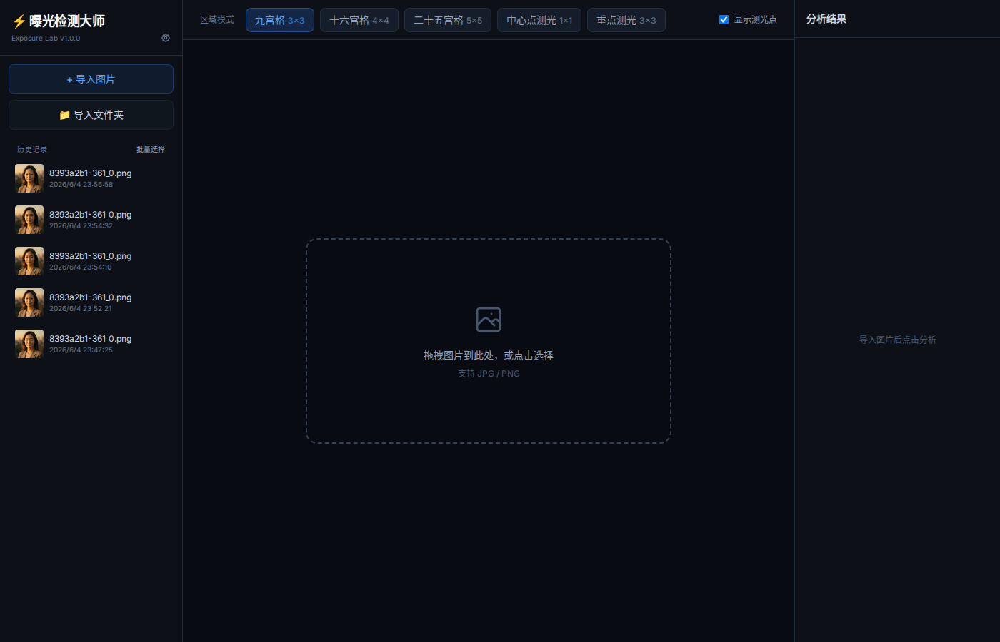
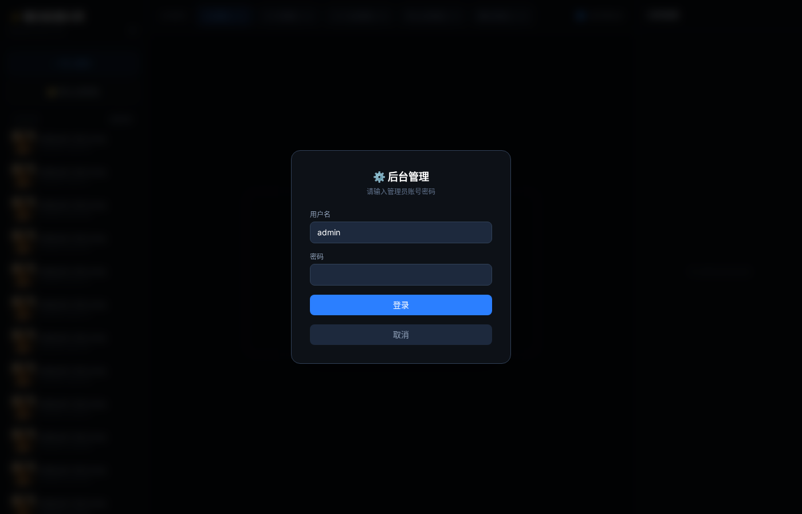
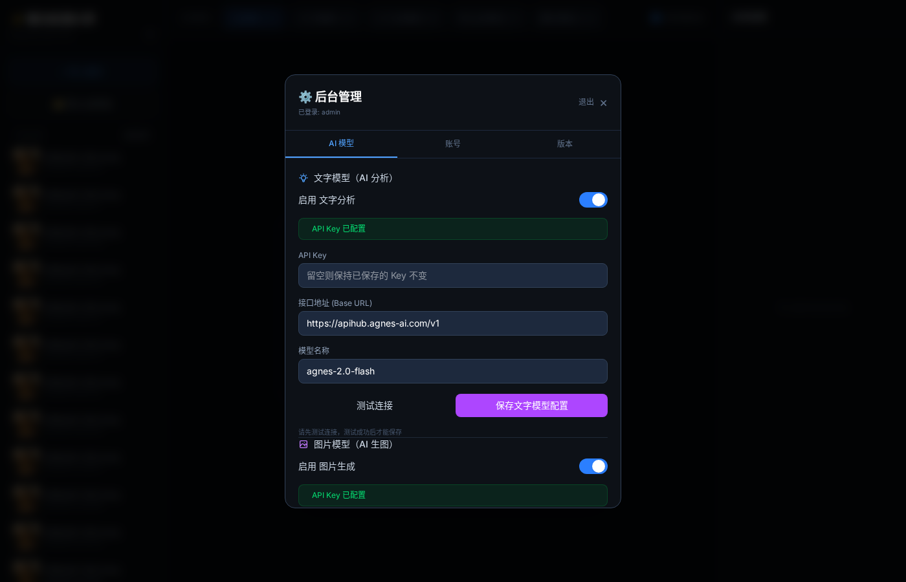
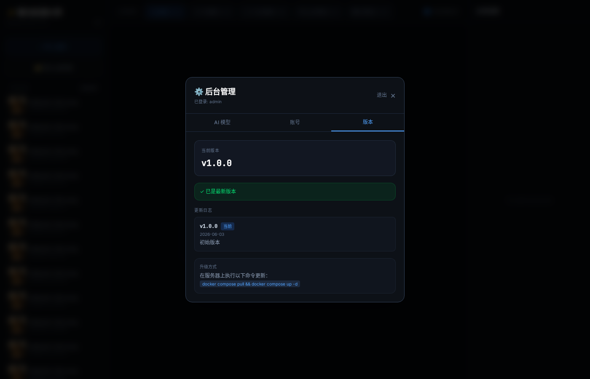
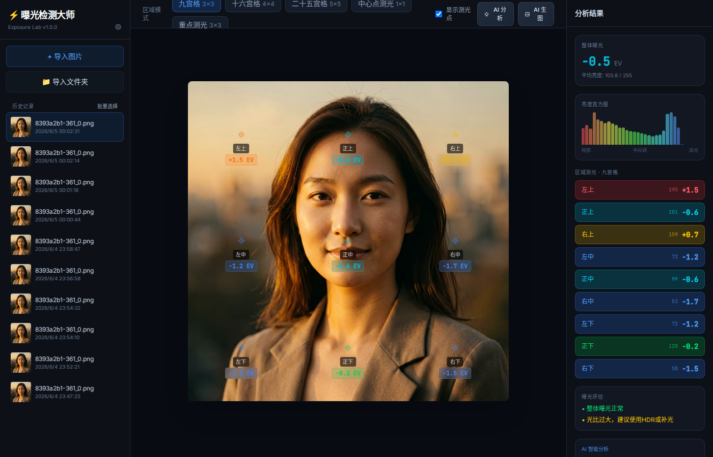
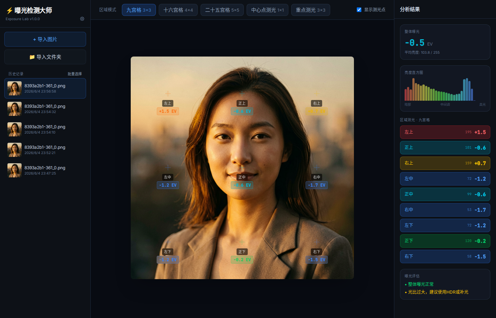
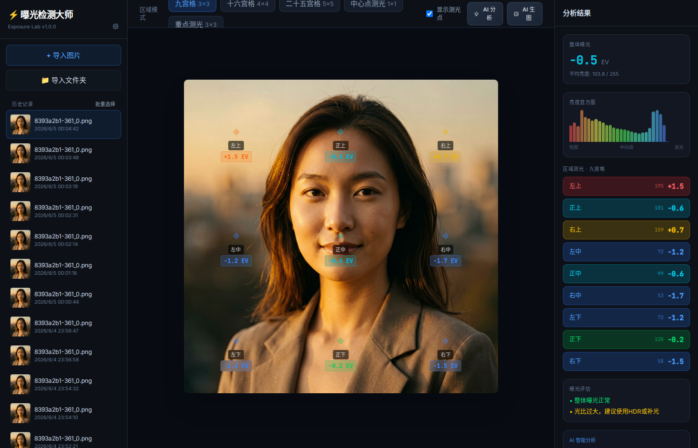

# ⚡ 镜头演算室 · LensLab

> 专业级 Web 区域曝光分析工具 — AI 生图 · 精准测光 · 大师风范

<p align="center">
  
</p>

[](https://github.com/dongjie-oss/exposure-lab)
[](https://python.org)
[](https://fastapi.tiangolo.com)
[](https://reactjs.org)
[](LICENSE)

---

## 📋 目录

- [功能特性](#功能特性)
- [截图一览](#截图一览)
- [AI 生图](#ai-生图)
- [区域测光模式](#区域测光模式)
- [适用场景](#适用场景)
- [快速启动](#快速启动)
- [Docker 部署](#docker-部署)
- [项目结构](#项目结构)
- [技术栈](#技术栈)
- [版本管理](#版本管理)
- [开发](#开发)
- [License](#license)

---

## ✨ 功能特性

### 🎯 区域曝光分析

- **📸 图片导入** — 支持 JPG / PNG，拖拽上传，一键粘贴
- **🎯 6种区域测光模式** — 九宫格 / 十六宫格 / 二十五宫格 / 中心点 / 重点测光 / 三分法
- **📊 智能曝光指数** — 每区域独立 EV 值（-3EV ~ +3EV），128灰为基准
- **🗺️ 实时叠加显示** — 测光点直接标注在原图上，十字线 + 区域名称 + EV 值
- **📈 亮度直方图** — 全局亮度分布可视化
- **💡 曝光评估** — 智能分析过曝/欠曝/光比，给出拍摄建议
- **🗂️ 历史记录** — 自动保存分析结果，方便前后对比

### 🤖 AI 生图

- **🎨 九宫格 AI 生成** — 基于选中 9 宫格区域，AI 批量生成不同风格的创意图片
- **📝 自定义提示词** — 支持提示词模板的多选和 CRUD 管理
- **🌐 全局风格** — 单选的全局风格控制，统一整体视觉效果
- **🔁 生成类似图片** — 基于生成结果再扩散，获得更多相似创意
- **🧩 智能九宫格策略** — 根据提示词 + 全局风格 + 类似图片的组合，自动决定生成数量和布局

### 🛠️ 管理面板

- **🔐 管理员登录** — 安全的后台管理入口
- **🤖 AI 配置** — 在线管理 API Key、模型、Endpoint
- **📋 提示词管理** — CRUD 操作提示词模板（提示词 / 全局风格两类）
- **🔄 版本检查** — 自动检测 ACR 仓库最新版本，提醒更新

---

## 📸 截图一览

| 登录页 | 管理面板 | 版本检查 |
|--------|----------|----------|
|  |  |  |

| AI 生图按钮 | 生成面板 | 生成结果 |
|-------------|----------|----------|
|  |  |  |

---

## 🤖 AI 生图

### 九宫格生成策略

| 场景 | 生成数量 | 说明 |
|------|----------|------|
| 什么都不选 | 9 张 | 9 种默认风格，填满九宫格 |
| 只选全局风格 | 1 张 | 大图展示占满 9 格 |
| 全局 + 类似图片（无提示词） | 9 张 | 全局风格 × 多样内容 |
| 只选 1 个提示词 | 9 张 | 提示词 × 9 种默认风格 |
| 1 个提示词 + 类似图片 | 9 张 | 1 张提示词 + 8 张类似扩散 |
| N 个提示词（＞1） | N 张 | 每格一张，N ≤ 9 |
| 全局 + N 个提示词 | N 张 | 全局风格作为基底 |

### 提示词模板

- **提示词** — 描述画面内容的文字模板，可多选组合
- **全局风格** — 控制整体视觉风格（如"电影感"、"水彩"），单选

---

## 🎯 区域测光模式

| 模式 | 区域数 | 适用场景 |
|------|--------|---------|
| 九宫格 (3×3) | 9 | 风景摄影、构图分析 |
| 十六宫格 (4×4) | 16 | 精细测光、建筑摄影 |
| 二十五宫格 (5×5) | 25 | 高精度分析、产品摄影 |
| 中心点 | 1 | 中央重点构图 |
| 重点测光 | 1 | 人像、特写 |
| 三分法 | 可变 | 经典构图辅助 |

### 区域测光原理

1. 图片转为灰度图（L 通道）
2. 按选定模式划分区域网格
3. 计算每个区域平均亮度（0-255）
4. 映射到曝光指数：`EV = (亮度 - 128) / 45`
5. 结果限制在 -3EV ~ +3EV 范围

---

## 🚀 快速启动

### 方式一：本地运行

```bash
# 克隆项目
git clone https://github.com/dongjie-oss/exposure-lab.git
cd exposure-lab

# 安装依赖
pip install -r backend/requirements.txt

# 启动服务
python3 run.py
```

浏览器访问: http://localhost:8888

> 默认管理员账号: `admin` / `admin`

### 方式二：Docker Compose（推荐）

```bash
# 克隆项目
git clone https://github.com/dongjie-oss/exposure-lab.git
cd exposure-lab

# 创建数据目录
mkdir -p data/uploads data/results

# 一键启动
docker compose up -d
```

浏览器访问: http://localhost:8765

> 用户数据自动持久化到 `./data/` 目录，升级容器不会丢失

### 方式三：Docker 直接运行

```bash
docker build -t lenslab:latest .
docker run -d \
  --name lenslab \
  -p 8765:8765 \
  -v $(pwd)/data:/app/data \
  lenslab:latest
```

---

## 🐳 Docker 部署

### 镜像地址

```bash
# 阿里云容器镜像服务
docker pull registry.cn-hangzhou.aliyuncs.com/{namespace}/exposure-lab:v1.0.0
```

### 环境变量

| 变量 | 默认值 | 说明 |
|------|--------|------|
| `PORT` | `8765` | 服务端口 |
| `DATA_DIR` | `/app/data` | 数据持久化目录 |
| `ACR_REGISTRY` | `registry.cn-hangzhou.aliyuncs.com` | ACR 仓库地址 |
| `ACR_NAMESPACE` | `""` | ACR 命名空间 |
| `ACR_REPO` | `exposure-lab` | ACR 仓库名称 |

### 数据持久化

```
./data/
  ├── config.json      # 配置文件（含认证、AI 设置）
  ├── uploads/         # 上传图片（自动清理）
  └── results/         # AI 生成结果（自动清理）
```

> 镜像只包含代码，用户数据通过 `volumes` 挂载，升级容器零损失。

---

## 📁 项目结构

```
exposure-lab/
├── backend/
│   ├── server.py              # FastAPI 应用入口
│   ├── analyzer.py            # 核心测光算法引擎
│   ├── ai_generator.py        # AI 生图引擎
│   ├── config_manager.py      # 配置管理模块
│   ├── data_manager.py        # 统一数据持久化框架
│   ├── versions.py            # 版本管理与 ACR 检查
│   ├── init_config.py         # 首次运行配置初始化
│   ├── migrations/            # 数据迁移脚本
│   │   └── v0_to_v1.py
│   └── requirements.txt
├── frontend/
│   ├── app.jsx                # 主应用 JSX
│   ├── admin-panel.jsx        # 管理面板 JSX
│   ├── compile.js             # 编译脚本
│   ├── index.html             # 入口 HTML
│   ├── assets/                # 编译产物（CSS + JS）
│   └── package.json
├── data/                      # 运行时数据（不提交）
│   ├── config.json
│   ├── uploads/
│   └── results/
├── docker-compose.yml         # Docker Compose 配置
├── Dockerfile                 # Docker 构建
├── docker-entrypoint.sh       # 容器入口
├── run.py                     # 一键启动脚本
└── .env.example               # 环境变量模板
```

---

## 🔧 技术栈

### 后端
- **Python 3.11+** — 运行时
- **FastAPI** — Web 框架
- **Pillow / NumPy** — 图像处理
- **httpx** — AI API 异步请求
- **Uvicorn** — ASGI 服务器

### 前端
- **React 18** — UI 框架
- **Tailwind CSS 4** — 样式（CDN 静态编译）
- **Babel Standalone** — 浏览器端 JSX 编译

### 部署
- **Docker** — 容器化
- **Docker Compose** — 编排
- **阿里云 ACR** — 镜像仓库

---

## 📦 版本管理

项目使用语义化版本控制，结合 Git 标签和 ACR 镜像标签。

| 版本 | 标签 | 说明 |
|------|------|------|
| v1.0.0 | `v1.0.0` | 初始发布 |
| ... | ... | ... |

- **Git 标签** — GitHub releases 管理
- **镜像标签** — ACR 镜像版本管理
- **自动检测** — 管理面板可检查最新版本

---

## 💻 开发

### 前端热编译

```bash
cd frontend
npm install
node compile.js    # 编译 JSX → assets/app.compiled.js
```

> 编译后通过 `docker cp` 部署到运行中的容器。

### 构建镜像

```bash
cd exposure-lab
docker build -t exposure-lab:v1.0.0 .
```

---

## 📄 License

MIT License — 详见 [LICENSE](LICENSE)

---

<p align="center">
  <sub>Powered by darkness, precision, and AI. 镜头演算室 · 从测光到创作</sub>
</p>